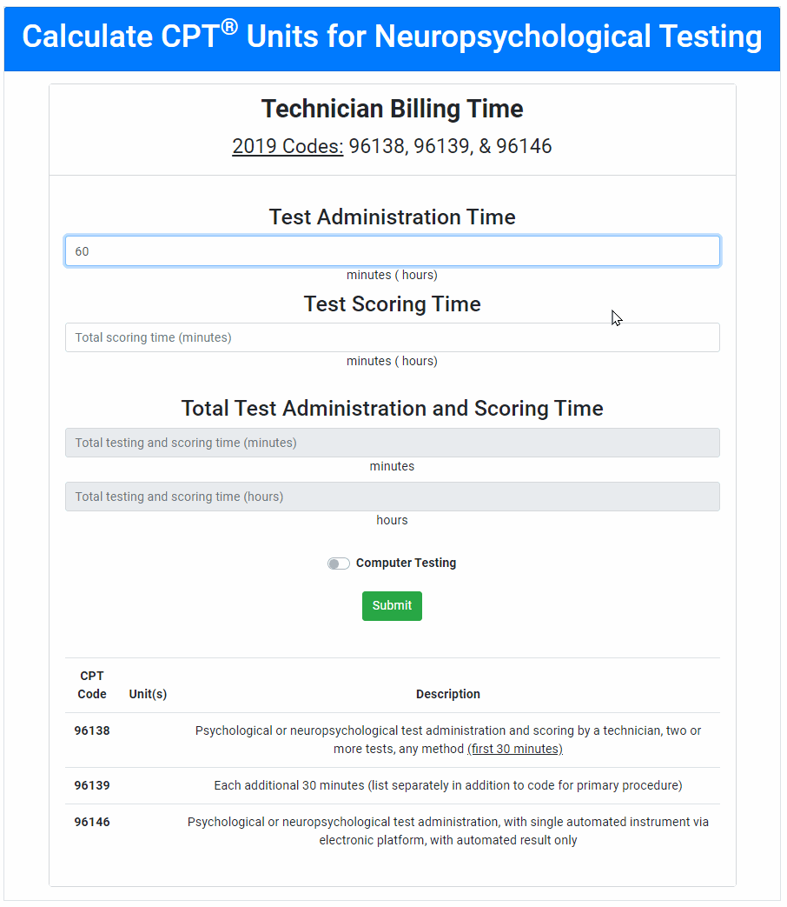

# 📚 CS50x (Fall 2020)

CS50x: Introduction to Computer Science (Harvard on edX) is a virtual, introductory course to computer science. Course information is available on the [CS50x Harvard website](https://cs50.harvard.edu/x/2020/) or [on EdX](https://www.edx.org/course/cs50s-introduction-to-computer-science).

***Note: The code contained in this repository is available for informational purposes. You will learn more from the course if you complete each problem set independently.***

## Problem Sets

### [Problem Set 1: C](/pset1)
  * [Credit](/pset1/credit.c)
  * [Hello](/pset1/hello.c)
  * [Mario](/pset1/mario.c)

### [Problem Set 2: Arrays](/pset2)
  * [Caesar](/pset2/caesar.c)
  * [Readability](pset2/readability.c)

### [Problem Set 3: Algorithms](/pset3)
  * [Plurality](/pset3/plurality.c)
  * [Runoff](/pset3/runoff.c)

### [Problem Set 4: Memory](/pset4)
  * [Filter](/pset4/filter.c)
    * [Helpers](/pset4/helpers.c)
  * [Recover](/pset4/recover.c)

### [Problem Set 5: Data Structures](/pset5)
  * [Speller](/pset5/speller.c)

### [Problem Set 6: Python](/pset6)
  * [Hello](/pset6/hello.py)
  * [Mario](/pset6/mario.py)
  * [Cash](/pset6/cash.py)
  * [Readability](/pset6/readability.py)
  * [DNA](/pset6/dna/dna.py)

### [Problem Set 7: SQL](/pset7)
  * [Movies](/pset7/movies)
  * [Houses](/pset7/houses)

### [Problem Set 8: Information](/pset8)
  * [Finance](/pset8/finance/application.py)

### [Final Project: Web Track](/project)

# Final Project

For my capstone project, I created a web application for neuropsychologists to calculate certain billing codes for billing purposes.

**[See my GitHub folder for more information](/project)** or **[visit my webpage](http://cptcalc-kkphd.us-east-1.elasticbeanstalk.com/)**!

# #️⃣ CPT Calculator for Neuropsychological Assessment

  

A simple calculator to code technician-supported neuropsychological assessment in clinical settings; developed for neuropsychologists.

#### Project Status: Completed ✔️
 

Image taken from the following website:
> https://www.cms.gov/

## Objective
Neuropsychologists who accept insurance must submit superbills (an itemized form containing patient visit information) to Medicare and insurance companies to receive payment for services. This web-based application is a simple calculator for determining the appropriate units for technician-provided assessment services, which is perhaps the most popular or most preferred method of completing testing.

### Technologies
* Python
  * math
* flask
* HTML
* AWS

## Project Description
The current project was inspired by problems I encountered in my professional career, namely a desire for increased efficiency in calculating units for insurance billing while working in a clinical service line. This calculator reflects select Current Procedural Terminology (CPT) codes (specifically 96138, 96139, and 96146), which were updated on January 1, 2019 by the Centers for Medicare & Medicaid Services (CMS).

This application is highly convenient for neuropsychology services that have multiple technicians, providers, or staff, as it can be used from any location and for any client. **Neither patient health information nor user registration are required for use.**

For more information about billing codes, consult the [CMS website](https://www.cms.gov/).

## Featured Deliverable

1. 💻 This [calculator](http://cptcalc-kkphd.us-east-1.elasticbeanstalk.com/) converts minutes of technician test administration and scoring time to CPT units. (Load the page again to submit a new request.)

My website also contains helpful links for information about CPT codes, coding changes, and links to insurance companies' websites regarding neuropsychological assessment billing.

***Note: I do not assume any liability for the consequences of using this application. Use at your own discretion and confirm the output using your own calculations.***

## License
Usage is provided under the [MIT license](https://en.wikipedia.org/wiki/MIT_License). See the LICENSE.md file for details.

## Contact
If you have questions or thoughts, please contact me using the link on [my  main GitHub page](https://github.com/kkphd).
